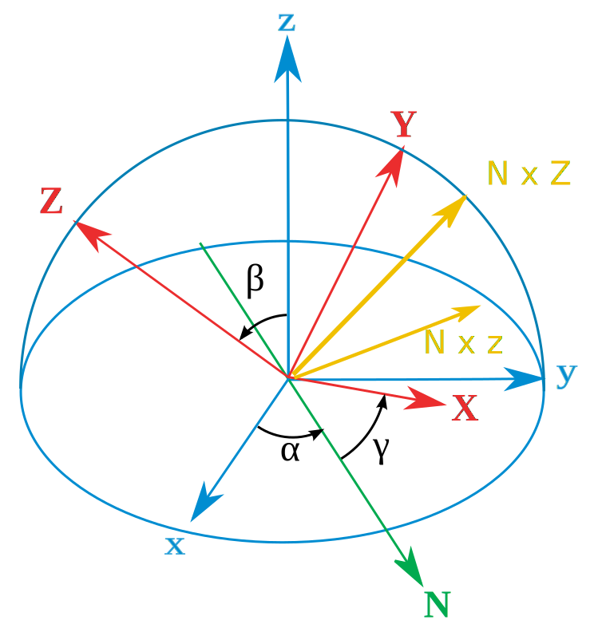
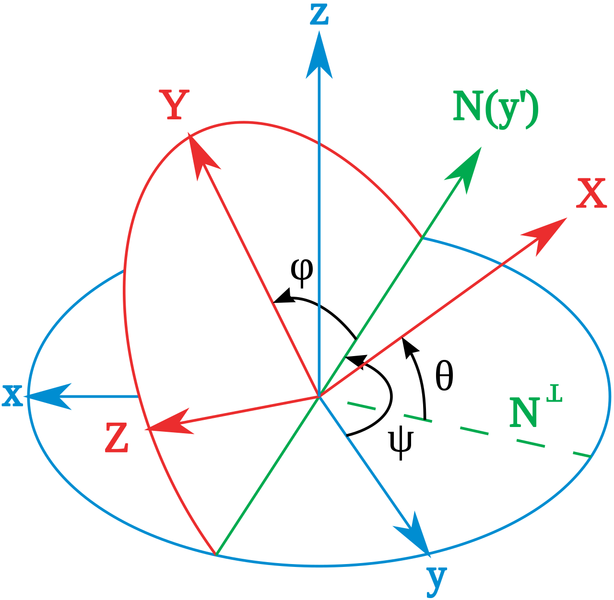
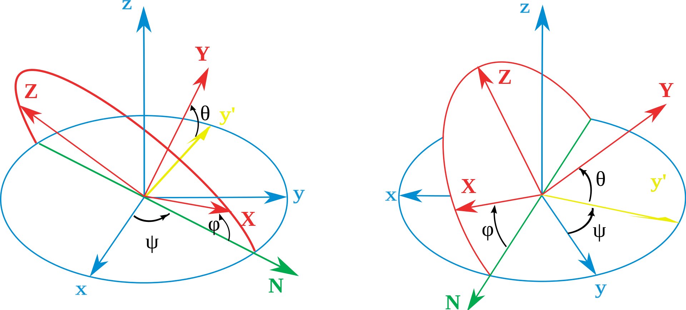

# 晶体塑性模拟

****

## 理 论

- ### 黄永刚院士的晶体塑性本构关系

[单晶体本构引入到 ABAQUS 有限元程序（原文）](http://www.columbia.edu/~jk2079/fem/umat_documentation.pdf)

[单晶体本构引入到 ABAQUS 有限元程序（翻译）](umat_documentation_huang.pdf)

关于黄永刚单晶理论和程序的详细补充和解释：[单晶塑性 自学](https://blog.csdn.net/Niklas4088/article/details/111942686)、[单晶塑性 自学—续](https://blog.csdn.net/Niklas4088/article/details/112747130?spm=1001.2014.3001.5501)

晶体的塑性本构可参考：[论文](https://wenku.baidu.com/view/9bf355a043323968011c9292.html)（13-18页）

[第八章 晶体的塑性形变](https://www.docin.com/p-1167871.html?docfrom=rrela)

[超塑性](https://blog.csdn.net/plkolili/article/details/78256244?spm=1001.2014.3001.5501)

- ### 镍基合金力学性能

[镍基合金力学性能与元素分配行为的第一原理研究](https://www.researchgate.net/publication/286327581_niejihejinlixuexingnengyuyuansufenpeixingweidediyiyuanliyanjiu_First-principles_study_of_the_mechanical_properties_and_elemental_partitioning_behaviors_in_Ni-based_superalloys)

- ### 单晶塑性

[黄永刚单晶塑性知识点汇总](https://blog.csdn.net/plkolili/article/details/78216097)

[黄永刚单晶塑性Umat解读（1）](https://zhuanlan.zhihu.com/p/410534771)

[黄永刚单晶塑性umat解读（2）](https://zhuanlan.zhihu.com/p/411023116)

[黄永刚单晶塑性umat解读（3）](https://zhuanlan.zhihu.com/p/411379978)

[最新黄永刚单晶塑性有限元umat子程序](https://www.mianfeiwendang.com/doc/4cfbe32af120fa28390b97ccb118da52bd8f438b)

[基于晶体塑性理论的面心立方单晶变形研究](https://www.mianfeiwendang.com/doc/5ed7784148b5e1bc8af6afbe40754a1ee6d5479b)

## 软件

- ### 基于ABAQUS的晶体塑性有限元（CPFEM）

#### [一个非常优秀的晶体塑性有限元说明网站](https://icme.hpc.msstate.edu/mediawiki/index.php/Code:_ABAQUS_CPFEM.html)

[黄永刚单晶塑性有限元umat子程序](http://www.columbia.edu/~jk2079/fem/umatcrystal_mod.f)

[Introduction_to_Crystal_Plasticity_Finite_Element_Method_v3.pdf (msstate.edu)](https://icme.hpc.msstate.edu/mediawiki/images/a/a9/Introduction_to_Crystal_Plasticity_Finite_Element_Method_v3.pdf)

[abaqus多晶模型的建立](https://blog.csdn.net/jieniansui2795/article/details/108017947)

[晶体塑性有限元 Abaqus 三维泰森多边形（voronoi模型](https://blog.csdn.net/weixin_44873868/article/details/105174849)

## CPFEM的算例

### 多晶铝的模拟

#### 视频：

##### [CPFEM子程序教程与ABAQUS|晶体塑性模拟-CPFEM subroutine tutorial with ABAQUS](https://www.bilibili.com/video/BV1p64y1D7e8/?spm_id_from=333.788.recommend_more_video.13) 

[Introduction_to_CPFEM_manual-1.pdf](Introduction_to_CPFEM_manual-1.pdf)

[CPFEM_Simulation_of_Aluminum_V2.pdf](CPFEM_Simulation_of_Aluminum_V2.pdf)

- ### abaqus的用户子程序UMAT

[UMAT的说明 (mit.edu)](https://abaqus-docs.mit.edu/2017/English/SIMACAESUBRefMap/simasub-c-umat.htm#simasub-c-umat)

### About how to run a UMAT on abaqus

If you are not familiar with Abaqus, we suggest you do several examples. There are many on the Internet, you can use Google search. For example: 

*[http://www.proffem.com/images/files/Free%20Abaqus%20tutorial%20for%20simple%20bracket%20modelling.pdf](http://www.proffem.com/images/files/Free Abaqus tutorial for simple bracket modelling.pdf)*

Then, you can learn how to run a UMAT on abaqus, it is very simple, there are also many toturials, for example:

*https://abaqus-docs.mit.edu/2017/English/SIMACAEANLRefMap/simaanl-c-subroutineover.htm#simaanl-c-subroutineover-t-IncludingUserSubroutinesInAModel-sma-topic1*

​                               

You can use Kysar’s UMAT directly: (Download the .f or .for code file, this is the UMAT code)

*http://www.columbia.edu/~jk2079/Kysar_Research_Laboratory/Single_Crystal_UMAT.html*

Your major tasks are using UMAT to solve problem (simulation of micro voids in Ni-based single crystal superalloys (NBSX) under fatigue load), writing UMAT is not a task for you. 

编写流程：
计算弹性雅克比矩阵、更新弹性试应力、读取状态变量（弹性应变和塑性应变以及等效塑性应变）、编写计算强化系数和等效Mises应力的子程序（方便随时调用）、屈服后计算等效塑性增量、计算当前应力、弹性应变、塑性应变、调用Mises子程序、计算弹塑性雅克比矩阵、更新状态变量。

[abaqus学习笔记-abaqus与umat调用基本原理](https://blog.csdn.net/weixin_34260991/article/details/93409617?utm_medium=distribute.pc_relevant.none-task-blog-2~default~baidujs_title~default-0.no_search_link&spm=1001.2101.3001.4242)

[Abaqus-Umat子程序理论基础与代码编写](https://www.bilibili.com/read/cv13541383?from=search)

[VUAMT 学习笔记](https://blog.csdn.net/plkolili/article/details/82594018)

[Abaqus材料用户子程序UMAT基础知识及手册例子完整解释](https://wenku.baidu.com/view/76dd432c561252d380eb6e7e.html?rec_flag=default&fr=Recommend_RelativeRecommend-10119,60321,40155,40251,60308,40355-pc_view_otherlike_new-6d7a5ec52cc58bd63186bd11)

[ABAQUS用户子程序不正经教程](https://www.zhihu.com/column/c_1326181715945893888)

[ABAQUS子程序UMAT里弹塑本构地实现.doc (book118.com)](https://max.book118.com/html/2019/0114/5113110313002001.shtm)

 [关于abaqus应用的部分总结](http://www.mechbbs.com/forum.php?mod=viewthread&tid=11)

1.首先看费康老师书第12章邓肯张模型开发。

刚度矩阵就是下面的矩阵。其实刚度矩阵类似于一维里面胡克定律的k（F=k*l 这个胡克定律）

## 相关知识

[计算材料学-第五章 微观力学行为和组构模拟](https://wenku.baidu.com/view/29e27a9d48fe04a1b0717fd5360cba1aa9118c71.html)

[晶体塑形自学—大变形](https://blog.csdn.net/Niklas4088/article/details/111770388?spm=1001.2014.3001.5501)

[Abaqus python 实例](https://blog.csdn.net/Niklas4088/article/details/114198784?spm=1001.2014.3001.5501)

[理解 欧拉角和坐标变换](https://blog.csdn.net/zhwzhaowei/article/details/83688266)很重要！！！

[Euler angles - Wikipedia](https://en.wikipedia.org/wiki/Euler_angles#Proper_Euler_angles)

[[Matlab科学绘图] 由欧拉角绘制极图和反极图](https://blog.csdn.net/zhwzhaowei/article/details/88553892?utm_medium=distribute.pc_relevant.none-task-blog-2%7Edefault%7EBlogCommendFromBaidu%7Edefault-7.no_search_link&depth_1-utm_source=distribute.pc_relevant.none-task-blog-2%7Edefault%7EBlogCommendFromBaidu%7Edefault-7.no_search_link)

### [欧拉角(Euler angles)](https://blog.csdn.net/bnrmaster/article/details/47125821)维基百科 

## [Tait–Bryan angles](https://en.wikipedia.org/wiki/Euler_angles#Proper_Euler_angles)维基百科 

Tait–Bryan angles. *z*-*y*′-*x*″ sequence (intrinsic rotations; *N* coincides with *y'*). The angle rotation sequence is *ψ*, *θ*, *φ*. Note that in this case *ψ* > 90° and *θ* is a negative angle.

Tait–Bryan angles. *z*-*x*′-*y*″ sequence (intrinsic rotations; *N* coincides with *x*′)

# 其他模拟软件

## 马普所的DAMASK

#### [DAMASK主页](https://damask.mpie.de/)

德国马普钢铁研究所开发的一个开源软件，软件旨在研究材料在多尺度下的力学响应，可以模拟单晶尺度到结构件尺度范围内多物理现象（如晶体塑性、热、损伤等）的高端材料模拟软件包。 软件基于Linux平台，借助PETSc, Abaqus, Marc等软件进行计算模拟。

#### [DAMASK教程](https://www.bilibili.com/video/BV1Fb4y1Y7eM/?spm_id_from=333.788.recommend_more_video.-1)

#### [晶体塑性有限元CPFEM 马普所DAMASK教程（英文）](https://www.bilibili.com/video/BV1Xf4y1r7vV/?spm_id_from=333.788.recommend_more_video.-1)

#### [DAMASK 晶体塑性模拟（中文）](https://www.bilibili.com/video/BV1ck4y1y7gS/?spm_id_from=333.788.recommend_more_video.-1)

## 相关文章

[Crystal plasticity investigation of friction effect on texture evolution of Al single crystal during ECAP](https://link.springer.com/content/pdf/10.1007%2Fs10853-010-4674-2.pdf)

[基于有限变形单晶塑性滑移的微观热力耦合模型及其有限元计算](https://www.doc88.com/p-7129937311172.html?r=1)

##### [Multiscale modeling of crystal plastic deformation of polycrystalline titanium at high temperatures](https://www.sciencedirect.com/science/article/abs/pii/S0045782518303244)

