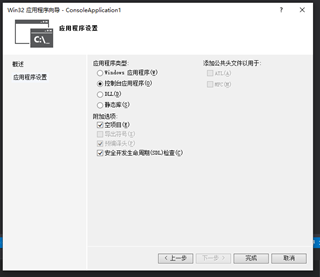
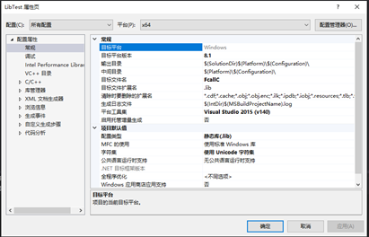
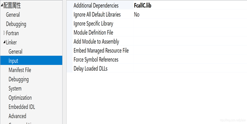
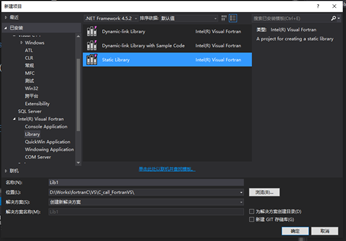
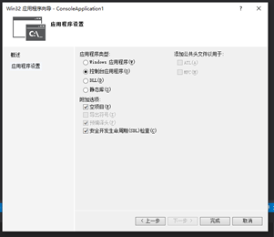
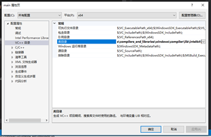

# C/C++/Fortran混合编程（用VS和IVF）

参考：**[C/C++/Fortran混合编程](https://www.cnblogs.com/xunxun1982/archive/2010/08/25/1808512.html)**

实现环境：win10、VS2015、IVF2019

# 混合编程注意事项

20210128郭

**C调Fortran的算例**

**1、intel版本中，c主程序调用的Fortran子程序名必须大写。**

**2、GNU版本中，c主程序调用的Fortran子程序名的程序名大小写不影响，但要名字后要加下划线。**

**Fortran调C的算例**

**1、intel版本中，c子程序名必须大写。**

**2、GNU版本中，c程序中的子程序名大小写不影响，但要名字后要加下划线。**

对于各个编译器，如果编译中间的二进制文件.o或.obj的结构相同，则可以直接链接混合编程。

遵循约定：C/C++默认传值，Fortran传址。

一般来说，尽量采用相同编译器家族：GNU家族（gcc\gfortran版本）或Intel家族（Intel C Compiler和Intel Fortran Compiler版本）。


# Fortran调用C语言静态库

Fortran作为历史比较悠久的编程语言，积累了大量的代码，要将其直接转换为C语言费时费力。因此研究两者之间的混合编程非常有必要。

接下来运用一些简单实例来说明如何在Intel Visual Fortran中利用Fortran调用C语言的静态库函数。

## 一、C语言静态库的生成

在csource.cpp文件：

```cpp
#include <stdio.h>
#include <stdlib.h>
 
extern "C" int ADD(int*, int*, int*);
 
int ADD(int* a, int* b, int* c) {
     *c = (*a + *b);
     return(1);
}
```

产生静态库FcallC.lib

### 1、利用命令行输入的方式生成：

```bash
cl.exe /c csource.cpp
lib.exe /OUT:FcallC.lib csource.obj
```

生成的静态库默认解决方案平台是x64。

 

### 2、利用VS生成：

打开VS2015，建立一个win32控制台程序，空项目。



然后打开项目--LibTest属性(如图1)，打开LibTest属性页(如图2)，在右边配置类型处选择静态库(lib)。生成的解决方案平台设置为x64。将准备好的源程序文件csource.cpp添加到项目中。

 

打开LibTest属性页，在右边配置类型处选择静态库(lib)，目标文件名设置为FcallC。

 

Build后生成FcallC.lib。

 

## 二、在Fortran中添加C语言静态库

配置Fortran工程属性

 

生成Fortran源程序文件Console1.F90。

```fortran
      program Console1
      implicit none
      ! Variables
      INTEGER :: A = 1
      INTEGER :: B = 3
      INTEGER :: C = 0
      CALL ADD(A, B, C)
      print *,C
      end
```

调用成功。

 

## 注意事项

**先后两次生成的解决方案平台必须相同。**

如果调用方也是C++的话，不需要处理函数名称重载的问题，但如果调用方是非C++的话，对于外部实用的函数需要添加：

```c
extern "C" {
函数声明定义1；
函数声明定义2：
};
```

 

另外，对于在C++中使用C的静态库：需要加上 extern "C"，同样是为了解决名称在C++中会被重载的问题。

```c++
extern "c" {
#include "xxx.h"
}
```

 

# C语言调用Fortran静态库

## 一、Fortran静态库的生成

**实验不成功！！！** 

**main.c**

```c
#include <stdio.h>
void SUB_FORTRAN(int *, float *, double *);
double FUNCTION_FORTRAN(double *);
int main()
{
       int num_int;
       float num_float;
       double num_double;
       double num;
       num_int = 3;
       num_float = 5.0;
       SUB_FORTRAN(&num_int, &num_float, &num_double);
       num = FUNCTION_FORTRAN(&num_double);
       printf("num_int=%d\nnum_float=%f\nnum_double=%f\nnum=%f", num_int, num_float, num_double, num);
       return 0;
}
```

**sub.f90**

```fortran
subroutine sub_fortran(NumInt,NumFloat,NumDouble)
      use ISO_C_BINDING
      implicit none
      integer(c_int) :: NumInt
      real(c_float) :: NumFloat
      real(c_double) :: NumDouble
      NumDouble=NumFloat**NumInt
end subroutine
 
real(c_double) function function_fortran(NumDouble)
      use ISO_C_BINDING
      implicit none
      real(c_double) :: NumDouble
      Function_Fortran=sqrt(NumDouble)
end function
```

#### 1、利用命令行输入的方式生成：

**执行命令：**

```bash
ifort –c sub.f90  –o sub.obj 
ifort –c sub.f90  –o sub.lib
```


#### 2、利用Intel Visual Fortran生成：

打开VS2015，建立一个Intel Visual Fortran的静态库项目程序。

 

将准备好的源程序文件sub.f90添加到项目中。生成的解决方案平台设置为x64。运行生成sub.lib。

## 二、在C语言主程序中添加Fortran静态库

打开VS2015，建立一个win32控制台程序，空项目。



生成的解决方案平台设置为x64。

将准备好的源程序文件main.c添加到项目中。

把静态库文件sub.lib拷贝到项目所在目录。

#### 添加静态库sub.lib

##### 法1:通过设置工程配置来添加lib库

A、添加工程的头文件目录：工程---属性---配置属性---c/c++---常规---附加包含目录：加上头文件存放目录。

B、添加文件引用的lib静态库路径：工程---属性---配置属性---链接器---常规---附加库目录：加上lib文件存放目录。
 C、然后添加工程引用的lib文件名：工程---属性---配置属性---链接器---输入---附加依赖项：加上lib文件名。

这种方法比较繁琐,且不直观,而且还可能要争对debug版本和release版本作不同的配置,因为我们生成的两个版本的库可能放在不同的目录中的。

##### 方法2:使用编译语句

 #ifdef _DEBUG
 \#pragma comment(lib,"..\\debug\\LedCtrlBoard.lib")
 \#else
 \#pragma comment(lib,"..\\release\\LedCtrlBoard.lib")
 \#endif

这种方法直观,方便,且可以按如上直接区分出Debug版本和Release版本的不同目录.当然,通过宏,还可以区分更多版本。

但是在指定目录时,不小心容易出错。

##### 方法3: 直接添加库文件到工程中.

就像你添加.h和.cpp文件一样,把lib文件添加到工程文件列表中去.

VC中,切换到"解决方案视图",--->选中要添加lib的工程-->点击右键-->"添加"-->"现有项"-->选择lib文件-->确定.

参考：[如何在VS2012 C++项目里面添加静态库文件lib](https://blog.csdn.net/aaa123524457/article/details/51345718)


## 问题

##### 编译后碰到问题：LNK1104 无法打开文件“ifmodintr.lib”

查找到相关文章：

Intel公司的讨论板块：

[已解决: LNK1104 cannot open file 'ifmodintr.lib'](https://community.intel.com/t5/Intel-Fortran-Compiler/LNK1104-cannot-open-file-ifmodintr-lib/m-p/1167878)

Visual Studio对混合编程的说明：

[Configuring Visual Studio for Mixed-Language Applications (intel.com)](https://software.intel.com/content/www/us/en/develop/articles/configuring-visual-studio-for-mixed-language-applications.html)

##### 最后解决方法：

1、搜索ifmodintr.lib文件的目录：

在我的机子上是：

C:\Program Files (x86)\IntelSWTools\compilers_and_libraries\windows\compiler\lib\intel64\

会有很多，注意要跟你的项目一致。

2、添加库目录

工程---属性---配置属性---VC++目录---库目录：在最后添加：

;C:\Program Files (x86)\IntelSWTools\compilers_and_libraries\windows\compiler\lib\intel64\

 

最后问题得到解决。


# 参考文章：

[在Intel Visual Fortran中混合编程一：使用Fortran调用C语言静态库_jpfalan的博客-CSDN博客](https://blog.csdn.net/jpfalan/article/details/104562193)

[C++ / vs 如何生成自己的静态库(lib)文件 - 程序员大本营 (pianshen.com)](https://www.pianshen.com/article/388260710/)

[Tutorial: Using C/C++ and Fortran together](http://www.yolinux.com/TUTORIALS/LinuxTutorialMixingFortranAndC.html)

[VS中创建静态库&C/C++静态库的使用](https://blog.csdn.net/chunyexiyu/article/details/31014221)

 

 

 