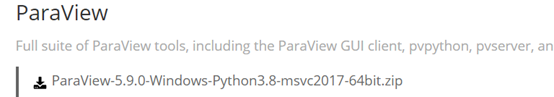
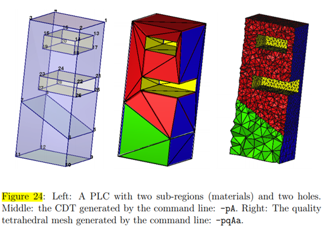
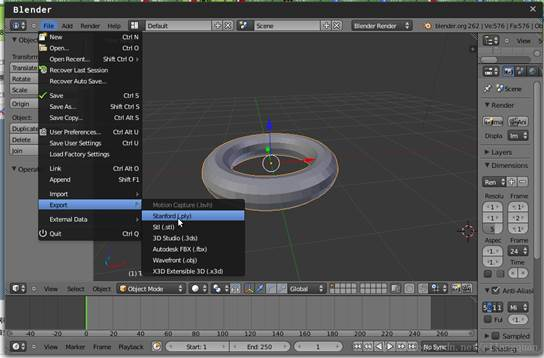
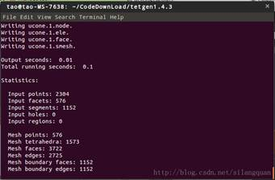

# 使用TetGen进行3D Delaunary网格划分

20200126郭

## 一、ParaView软件

下载位置：https://www.paraview.org/download/



下载Windows版本，解压后可以直接执行

.\ParaView-5.9.0-Windows-Python3.8-msvc2017-64bit\bin\文件夹里的paraview.exe

 

## 二、TetGen源代码下载

参考用户手册：http://www.tetgen.org/1.5/doc/manual/manual.pdf

TetGen用户手册中文版https://pan.baidu.com/s/1o6E5nf0

https://wenku.baidu.com/view/a42ea67d3169a4517723a3cd.html

  

下载位置：

https://github.com/ufz/tetgen

http://wias-berlin.de/software/tetgen/

点击download ZIP，下载压缩文件。

 

## 三、生成TetGen的可执行程序tetgen.exe

1.解压后，进入DOS状态，

2.执行：

**方式一：**

```bash
make
```

（**前提**：安装过CMake编译环境，https://baike.baidu.com/item/mingw/1777782?fr=aladdin）

**方式二：**

另外一种方式：the files are usually easy to compile directly on the command line. Assume you’re using g++, first compile the file predicates.cxx to get an object file: 

先执行：

```bash
g++ -c predicates.cxx 
```

To compile TetGen into an executable file, use the following command: 

再执行：

```bash
g++ -o tetgen tetgen.cxx predicates.o –lm 
```

 

3.生成动态链接库 **tetgen.o** 和 **libtet.a**

To compile TetGen into a library, the symbol TETLIBRARY is needed:

```
g++ -O3 -DTETLIBRARY -c tetgen.cxx
g++ -O0 -c predicates.cxx
ar r libtet.a tetgen.o predicates.o 
```

 

## 四、执行算例

（在文件手册3.2 A Short Tutorial有一个简单使用说明。）

再加压目录中继续执行：

```bash
tetgen –h
```

 保证文件夹中包含算例文件 example.poly, 是一个简单的算例，见手册中5.4.3 A PLC with Two Sub-regions and Two Holes节。 

```
tetgen -p example.poly
```

（**一开始失败几次，没找到原因，好像是没提前执行tetgen –h**）

 

加密网格

```
tetgen -pq example.poly 
```

 

指定加密网格信息q1.2 是网格质量

```
tetgen -pq1.2V example.poly
```

 

 

## 五、生成ParaView格式

也可以执行：-k 

```
tetgen -p -k example.poly 
```

生成ParaView格式的网格信息文件example.1.vtk。

 

加密网格

```
tetgen -pq –k example.poly 
```

指定加密网格信息，q1.2V 是网格质量

```
tetgen -pq1.2V –k example.poly 
```

 



 

## 六、在其他程序中调用TetGen 

手册中：6 Calling TetGen from Another Program

**手册中这个命令有错，编译通不过。**

```
g++ -o test tetcall.cxx -L./ -ltet
```

应该改为：

```
g++ -DTETLIBRARY -o test tetcall.cxx -L./ -ltet
```

  

## 补充

较好的文章：

https://blog.csdn.net/silangquan/article/details/10475015

 

**Netgen** 也是一款网格剖分软件，为奥地利科学家Joachim Schoeberl负责编写的格网（曲面和实体）剖分程序。是格网划分技术中极为先进与完善的，在3D格网划分领域更是具有极大的优势。

官网：http://www.hpfem.jku.at/netgen/

 

**Stellar**的中文意思是恒星，这是一个博士写的用于优化网格的软件，可以将生成的单元模型进行一些smooth、删除重复边的操作。


# tetview是用于查看网格模型的工具

## Medit 模型查看软件

TetGen can export its tetrahedral mesh into the .mesh format. It can be then visualized by the software Medit, which is freely available from http://www.ann.jussieu.fr/~frey/logiciels.

For viewing mesh under Medit, add a -g switch in the command line. TetGen will additionally output a file named **example.1.mesh**, which can be read and rendered directly by TetGen. Try running:

```
tetgen -pg example.poly
```

**medit example.1**

一篇介绍论文：https://hal.inria.fr/inria-00069921/document

 

利用blender生成模型

 

首先打开**blender**，Add->Mesh->Torus,添加一个圆环，然后File->Export->Stanford(.ply)，导出ply文件，待会用于剖分。



 

将导出的ply模型放到tetgen的目录，终端执行：

```
./tetgen -p torus.ply
```


 

  

# 用VS编译时的问题

#### 1、[严重性代码说明项目文件行错误C4996'strcpy'，strcpy头文件](https://www.cnblogs.com/didiaoxiaoguai/p/9022413.html)

用VS编译代码是遇到如上问题，vs准备弃用strcpy的，安全性较低，所以微软提供了strcpy_s来代替，如果想继续使用strcpy的，main前面加上

```
#pragma warning(disable:4996)
```

#### 2、“const char *“ 类型的实参与 “LPCWSTR“ 类型的形参不兼容，Visual Studio 2019

在VS2019中依次点击项目->属性->C/C+±>语言->符合模式，将原来的“是”改为“否”即可。 

 

# 一些参考文章：

3D建模与处理软件简介https://blog.csdn.net/sduvec/article/details/47302265

基于tetgen对曲面分隔的box区域做限定四面体剖分https://www.cnblogs.com/chnhideyoshi/p/ConstrainedTetrahedralization.html

网格工具综述https://www.cnblogs.com/jameszhan/archive/2013/05/09/grid.html

FORTRAN90 Source Codes https://people.sc.fsu.edu/~jburkardt/f_src/f_src.html

 

 Guibas, Leo J.; Stolfi, Jorge (1983). [ACM Press the fifteenth annual ACM symposium - Not Known (1983..-..)] Proceedings of the fifteenth annual ACM symposium on Theory of computing - STOC '83 - Primitives for the manipulation of general subdivisions and the computation of Voronoi diagrams. , (), 221–234.     doi:10.1145/800061.808751   

 

 