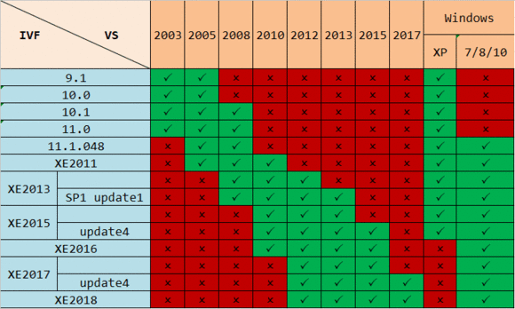

# vs和fortran的兼容问题

VisualStudio是微软公司推出的开发环境。是目前最流行的Windows平台应用程序开发环境。Intel Visual Fortran是使用fortran编程的编译工具。它们之间的兼容性如下：

## 新旧版本共存的方式

****************************************************************
可采用以下安装顺序：
先安装了VS2010；再安装了VS2019；
然后安装fortran2020；最后安装fortran2013；
**结果VS2010能编译fortran2013，VS2019能编译fortran2020。**
这样，两个版本可以共存了！

****************************************************************

##### 参考

[Intel Parallel Studio XE 2020其中的Intel Visual Fortran 与 Visual Studio2019安装与整合](https://www.liangzl.com/get-article-detail-161716.html)